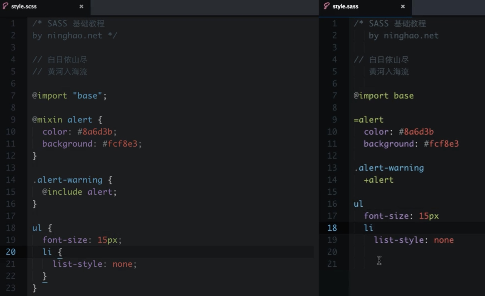

# Sass 入门
### 安装
```sass``` 是基于 ```Ruby``` 语言开发的, 所以可以使用 Ruby 的包管理器 ```gem``` 安装.
```shell
sudo gem install sass
```
### 查看版本
```shell
sass -v
```
### 交互执行
```
sass -i
```
### 编译
#### 编译单个文件
```sass
1. sass input.sass:output.css
2. sass input.sass output.css
```
#### 监视
```sass
//单文件监听命令
sass --watch input.scss:output.css

//如果你有很多的sass文件的目录，你也可以告诉sass监听整个目录：
sass --watch app/sass:public/stylesheets
```

#### 命令行编译配置选项
```sass
//编译格式
sass --watch input.scss:output.css --style compact

//编译添加调试map
sass --watch input.scss:output.css --sourcemap

//选择编译格式并添加调试map
sass --watch input.scss:output.css --style expanded --sourcemap

//开启debug信息
sass --watch input.scss:output.css --debug-info

--style 表示解析后的 css 是什么排版格式;
sass内置有四种编译格式: nested(默认 嵌套) expanded(扩展) compact(紧凑) compressed(压缩)
--sourcemap 表示开启 sourcemap 调试。开启 sourcemap 调试后，会生成一个后缀名为 .css.map 文件
```

### sass 两种语法
#### sass(.sass 扩展名)缩进式
#### scss(.scss 扩展名)大括号


### 变量名用中划线还是下划线分隔
```都可以, 两种用法相互兼容```

### 嵌套 css 规则
由外向内, 外面的选择器加在内部选择器的前面, 使用 ```空格``` 隔开.

### &
默认情况下是 是使用 ```空格 拼接 父选择器 和 子选择器 ```
& 的意意思是 ``` 使用 父选择器 替换 & 符号 ```

### 群组选择器


### 子组合选择器 >
### 用同层全体组合选择器 ~
### 同层相邻组合选择器 +
```sass
article {
  ~ article { border-top: 1px dashed #ccc }
  > section { background: #eee }
  dl > {
    dt { color: #333 }
    dd { color: #555 }
  }
  nav + & { margin-top: 0 }
}
sass会如你所愿地将这些嵌套规则一一解开组合在一起：

article ~ article { border-top: 1px dashed #ccc }
article > footer { background: #eee }
article dl > dt { color: #333 }
article dl > dd { color: #555 }
nav + article { margin-top: 0 }
```

### 嵌套属性
把属性名从中划线 - 的地方断开，在根属性后边添加一个 冒号 :，紧跟一个 { } 块，把子属性部分写在这个 { } 块中.

```sass
nav {
  border: {
  style: solid;
  width: 1px;
  color: #ccc;
  }
}

编译后

nav {
  border-style: solid;
  border-width: 1px;
  border-color: #ccc;
}
```

### 导入 sass 文件
1. 使用sass的@import规则并不需要指明被导入文件的全名。你可以省略.sass或.scss文件后缀
2. 使用 sass 部分文件: sass局部文件的文件名以下划线开头。这样，sass就不会在编译时单独编译这个文件输出css，而只把这个文件用作导入。当你@import一个局部文件时，还可以不写文件的全名，即省略文件名开头的下划线。举例来说，你想导入themes/_night-sky.scss这个局部文件里的变量，你只需在样式表中写@import "themes/night-sky";

### 默认变量值 !default
```sass
如果这个变量被声明赋值了，那就用它声明的值，否则就用这个默认值

$fancybox-width: 400px !default;
.fancybox {
width: $fancybox-width;
}
```
### 注释
```sass
sass 的注释是不会出现在 编译好的 css 文件中的. 

// 单行注释
/* 多行注释 */ 
```

### 混合器
适合用来定义重复使用的样式.
使用 ``` @mixin ``` 定义 混合器, 使用 ``` @include ``` 调用.

```sass
// 混合器 $visited: green $visited 的默认值是 green
@mixin link-colors($normal, $hover, $visited: green) {
  color: $normal;
  &:hover { color: $hover; }
  &:visited { color: $visited; }
}

a {
  @include link-colors(red, blue);
}

```

### 使用选择器继承来精简CSS
是使用``` 组合选择器 ```实现
```sass
//通过选择器继承继承样式
.error {
  border: 1px solid red;
  background-color: #fdd;
}

.error a {
  color: red;
}

.seriousError {
  @extend .error;
  border-width: 3px;
}

编译后

.error, .seriousError {
  border: 1px solid red;
  background-color: #fdd;
}

.error a, .seriousError a {
  color: red;
}

.seriousError {
  border-width: 3px;
}
```

### 网址
https://www.sass.hk/guide/